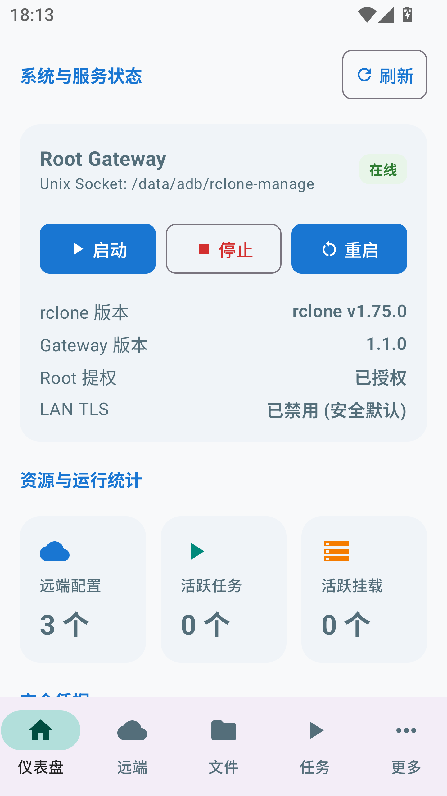
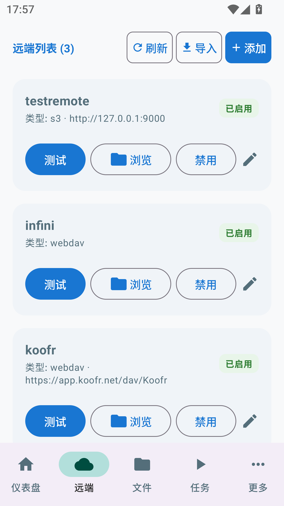
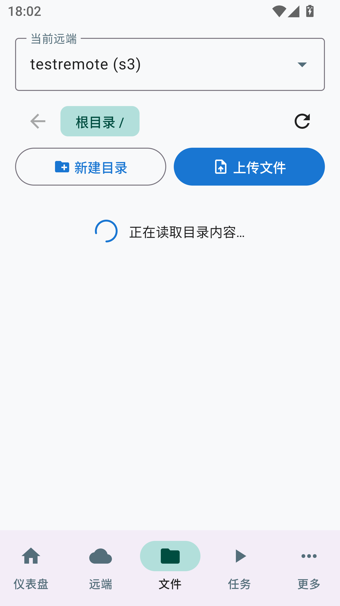
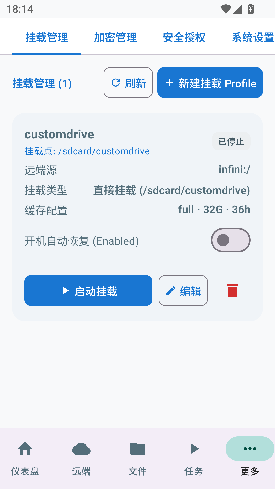
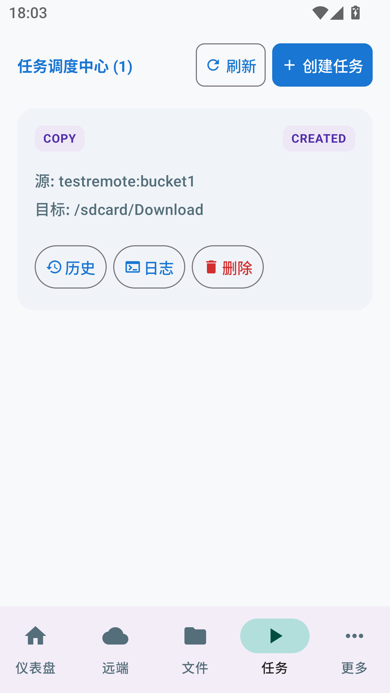
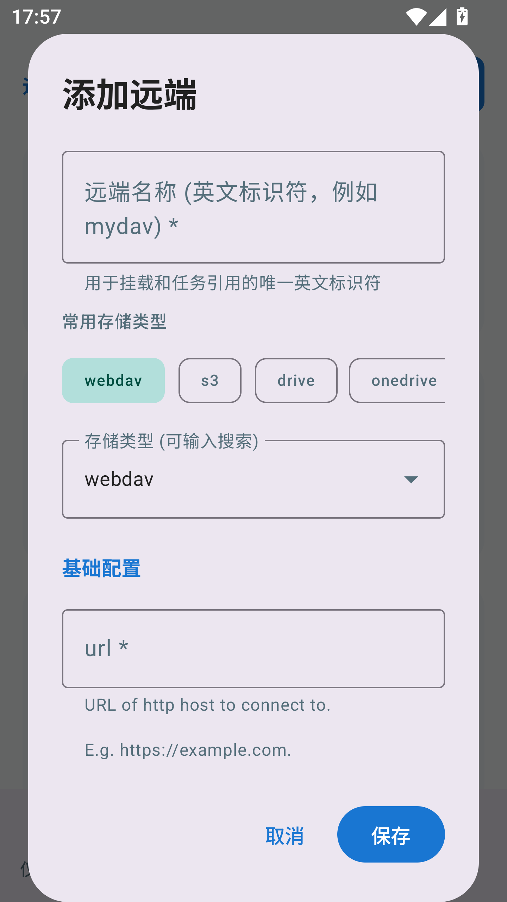
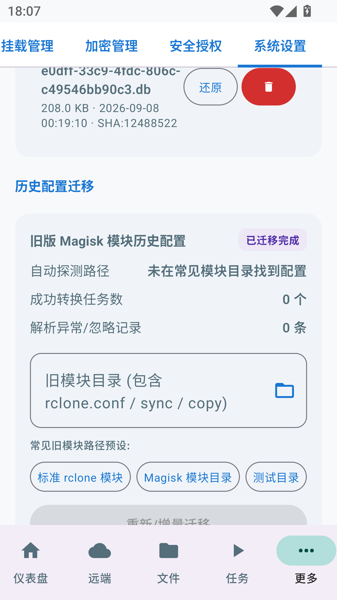
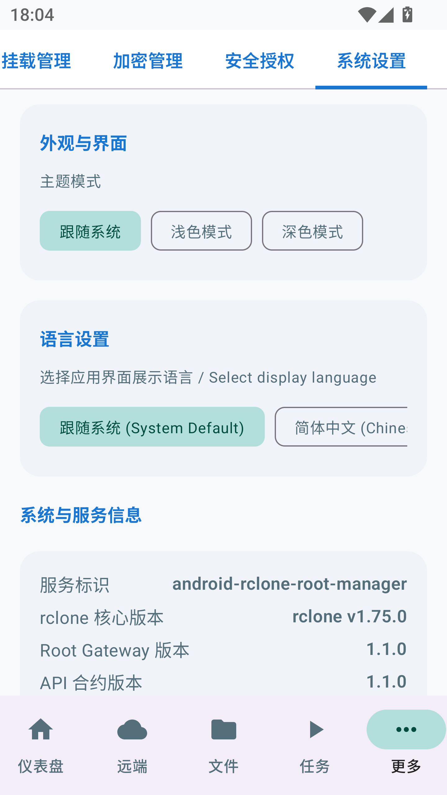
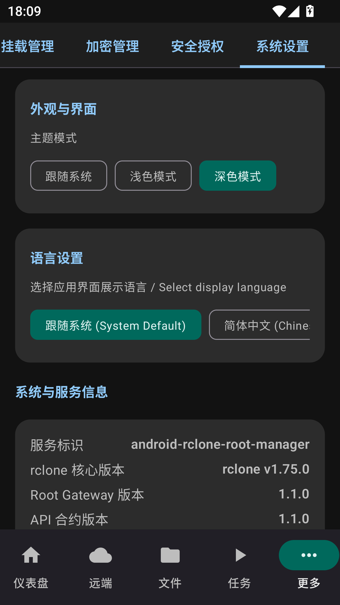

# Android Rclone Root Manager

<p align="center">
  <b>面向 Android 系统的现代化 Root 级云存储管理中枢与特权控制平面</b><br>
  <span>基于 <code>NewFuture/rclone-fuse3-magisk</code> 的全功能产品化重构方案</span>
</p>

<p align="center">
  <a href="README_EN.md"><b>English Documentation</b></a> | <b>简体中文</b>
</p>

<p align="center">
  
  
  
  
  
  
</p>

---

## 📖 1. 项目介绍

**Android Rclone Root Manager** 是一个专为 Android Root 环境打造的特权云存储控制平台。本项目将强大的云存储同步/挂载引擎 `rclone` 与 Android 现代移动体验深度融合，彻底解决了传统脚本方案权限失控、无统一后台管理、无安全隔离与界面简陋等痛点。

本项目采用 **All-in-One 纯服务模块（Pure Service, No System Mount）** 架构，用户仅需刷入单一模块，**不侵入、不挂载、不修改系统 System 分区**，即可获得完整的 FUSE3 挂载、后台守护、自动化任务调度与加密防护能力。

### 核心设计原则与分层架构

```text
┌─────────────────────────────────────────────────────────────┐
│                 Android App (用户控制面)                    │
│   Kotlin · Jetpack Compose · Material 3 · 状态监控 · 任务编排 │
└──────────────────────────────┬──────────────────────────────┘
                               │ libsu / Unix Domain Socket (权限 0600)
                               ▼ (固化 Typed API · 拒绝 Raw RC · 拒绝 Shell)
┌─────────────────────────────────────────────────────────────┐
│                 Root Gateway (特权安全边界)                  │
│    Rust 守护进程 · SQLite WAL · XChaCha20 密钥库 · 细粒度 ACL  │
│    HMAC 防重放 · 崩溃熔断 Safe Mode · 任务槽位事务互斥 · 审计脱敏 │
└──────────────────────────────┬──────────────────────────────┘
                               │ 内部受控进程 / 专有状态根 /data/adb/rclone-manage
                               ▼
┌─────────────────────────────────────────────────────────────┐
│                 rclone Core (高效数据平面)                   │
│   FUSE3 内核挂载 · 派生存储绑定 · Crypt 加密 · 云端传输引擎    │
└─────────────────────────────────────────────────────────────┘
```

1. **界面与特权完全解耦**：Android App 仅作为纯粹的控制端，App 被系统杀死或后台清理不会中断正在进行的后台同步与挂载任务。
2. **严禁暴露 Raw RC 与 Shell**：彻底封锁原生 rclone RC 端口与任意命令执行通道，所有操作必须通过 Gateway 提供的参数白名单及强类型 API 访问。
3. **状态与代码严格隔离**：业务数据、数据库与密钥持久化在专有受保护目录 `/data/adb/rclone-manage/`（0700），模块目录 `/data/adb/modules/rclone-manager/` 仅承载只读二进制与生命周期脚本。
4. **端到端加密保护**：云端凭据与 Crypt 密钥在持久化存储中由 XChaCha20-Poly1305 强力加密，API 接口仅暴露引用标识符（`secretRef`），绝不回传明文凭据。

---

## 📱 2. 软件界面截图

| 仪表盘总览 (Dashboard) | 远端存储管理 (Remotes) | 云存储文件浏览 (Files) |
|:---:|:---:|:---:|
|  |  |  |

| 挂载配置管理 (Mounts) | 任务编排与调度 (Jobs) | 新建远端配置 (Add Remote) |
|:---:|:---:|:---:|
|  |  |  |

| 旧版配置迁移 (Migration) | 系统状态与设置 (Settings) | 深色模式适配 (Dark Theme) |
|:---:|:---:|:---:|
|  |  |  |

---

## 🎯 3. 典型使用场景

### 场景一：云盘透明本地挂载（FUSE 虚拟盘）
- **痛点**：手机存储空间有限，百度网盘、OneDrive、Google Drive、WebDAV 等网盘中的超大视频和无损音乐下载耗时且占用本地空间。
- **方案**：配置挂载点至 `/mnt/rclone-<name>`，Gateway 自动派生受限共享存储绑定目标 `/data/media/0/<name>`。Android 本地相册、文件管理器、VLC、MX Player 等媒体播放器无需下载即可在线流式直接播放。

### 场景二：全自动相册与数据备份（条件策略门禁）
- **痛点**：传统同步脚本在低电量或移动流量下盲目执行，导致流量超额或设备快速耗尽电量。
- **方案**：创建定时 Job 任务，启用策略门禁（Policy Gates）：限制仅在 **连接非计费 Wi-Fi** 且 **设备处于充电状态** 时自动启动，支持增量同步（Sync）、单向复制（Copy）与双向镜像（Bisync）。

### 场景三：高强度云端隐私透明加密（Crypt）
- **痛点**：公有云盘存在文件审查、敏感隐私泄漏或明文泄密风险。
- **方案**：基于底层存储创建 Crypt 加密层。密码经本地 AES-CTR `obscure` 兼容编码后安全注入，云端所有文件名称与数据内容全程处于强加密状态，杜绝明文风险。

---

## 🚀 4. 挂载模式解析

挂载（Mount）是本项目的核心子系统之一。在 Android App 的创建/编辑挂载配置弹窗中，系统提供了两种核心挂载模式，并支持精细化 VFS 缓存调优：

```text
┌─────────────────────────────────────────────────────────────────────────────┐
│                          Root Gateway 挂载编排器                             │
└──────────────────────────────────────┬──────────────────────────────────────┘
                                       │
        ┌──────────────────────────────┴──────────────────────────────┐
        ▼                                                             ▼
【模式一：全局挂载 (Global Mount)】               【模式二：应用专属 (Isolated App Mount)】
  挂载点: /mnt/rclone-<name>                        挂载点: /data/data/<pkg>/files/rclone/<name>
  自动衍生绑定至 /data/media/0/<name>                精准绑定特定应用包名，动态匹配 UID/GID
  (相册、VLC播放器、全局文件管理器均可见)            (DAC 0700 权限物理拦截，防公共广播与相册抓取)
```

### 1. 全局挂载模式（Global Mount）
- **实现机制**：底层在 `/mnt/rclone-<name>` 创建 FUSE3 挂载点，Gateway 监听并在 FUSE 就绪后，自动派生受限共享绑定至公共存储 `/data/media/0/<name>`（即用户的 `/sdcard/<name>`）。
- **适用场景**：公共媒体库、大容量扩展盘。系统自带文件管理器、VLC、MX Player、Kodi 等媒体播放应用开箱即用，直接流式读取。
- **安全保障**：拒绝任意自定义危险 bind 路径；停止挂载时由 Gateway 自动解绑衍生目标并清理临时配置，杜绝僵尸挂载点。

### 2. 应用专属挂载模式（Isolated App Mount）
- **实现机制**：在 App 中选择“应用专属”并点选目标应用（内置已安装应用选择器），挂载点自动定位到该应用专属私有目录（如 `/data/data/<package>/files/rclone/<name>`）。Gateway 动态解析目标包名对应的 Linux UID/GID，启动 rclone 时自动注入 `--uid <UID> --gid <GID> --dir-perms 0700 --file-perms 0600`。
- **核心优势**：
  - **抑制广播**：跳过向公共 `/data/media/0/*` 的自动 bind 扩散，杜绝挂载广播。
  - **物理级隐私隔离**：依靠 Linux 内核原生 DAC 权限拦截，其他非 root 应用连进入该目录的权限都没有（严格返回 `Permission Denied`）。
  - **防缩略图扫描**：系统媒体扫描器（MediaStore）默认忽略应用私有目录，云盘内的私人照片与视频不会出现在系统相册中。
- **适用场景**：隐私相册、专用离线播放器、企业安全办公应用。

> 💡 **进阶技术说明**：技术预研文档 [`docs/isolated-app-mount-design.md`](docs/isolated-app-mount-design.md) 中探讨的通过 `nsenter` 切入进程 Mount Namespace 的方案属于底层探索路线；当前 Android App 落地采用的是开机更稳健、无需依赖前台活动进程的**应用沙盒原生权限隔离方案**。

### 3. VFS 缓存策略与保护机制
- **缓存模式（VFS Cache Mode）**：
  - `off` / `minimal`：极速直接流式传输，零占用本地空间。
  - `writes`：仅缓存本地写操作，保障数据上传完整性。
  - `full`（高清流媒体推荐）：提供多线程分块预读（Read-ahead）与断点续传支持，大文件拖拽进度条秒级响应。
- **自动容量淘汰**：可配置 `cacheMaxSize`（如 10G）与 `cacheMaxAge`（如 24h），后台自动按 LRU 清理旧缓存，避免设备闪存耗尽。
- **只读保护开关（Read-Only）**：一键开启只读，从协议层阻断本地对云端文件的任何意外修改或误删。

---

## 🛡️ 5. KernelSU (KSU) 最小特权配置专项说明

在现代 Android 权限加固体系中，**“拥有 Root 并不意味着应当滥用全特权”**。本项目提供专为 [KernelSU](https://kernelsu.org/) 优化的 App Profile 配置（见 [`docs/app_profile.json`](docs/app_profile.json)），严格践行**最小特权原则（Least Privilege）**：

```json
{
    "version": 1,
    "package": "io.github.poweran2020.rclone.manager",
    "name": "Rclone Root Manager",
    "root": {
        "enabled": true,
        "uid": 0,
        "gid": 0,
        "groups": [ 0, 2000, 1015, 1028, 3003 ],
        "capabilities": [
            "CAP_DAC_OVERRIDE",
            "CAP_DAC_READ_SEARCH",
            "CAP_FOWNER",
            "CAP_KILL",
            "CAP_NET_ADMIN"
        ],
        "namespace": "inherited",
        "selinux": "u:r:ksu:s0"
    }
}
```

### 为什么这样配置？能力集深度解析

| 配置项 | 取值 | 最小特权设计目的 |
|:---|:---|:---|
| **Identity** | `uid: 0`, `gid: 0` | 满足与底层 Unix Domain Socket (`0600`) 及内核 FUSE 设备节点交互的所有者要求。 |
| **Group 2000** | `shell` | 允许与 Android 本地 Shell IPC 进行必要调试与状态探测通信。 |
| **Group 1015 & 1028** | `sdcard_rw`, `sdcard_r` | 允许读写外部共享存储 `/sdcard` 与 `/data/media/0`，确保挂载点能向大众应用正常共享。 |
| **Group 3003** | `inet` | 赋予打开网络套接字的权限，满足云存储数据传输与局域网配对通信需求。 |
| **CAP_DAC_OVERRIDE** | Linux Capability | 允许特权进程绕过 DAC 权限检查，安全读写专有安全根目录 `/data/adb/rclone-manage`。 |
| **CAP_DAC_READ_SEARCH** | Linux Capability | 允许遍历系统目录与存储节点，用于文件选择器与路径沙箱规范化校验。 |
| **CAP_FOWNER** | Linux Capability | 允许管理与清理 rclone worker 产生的临时配置文件及孤立挂载句柄。 |
| **CAP_KILL** | Linux Capability | 赋予精确发送终止信号的能力，用于停止特定挂载或任务进程，**杜绝暴力全局 `pkill`**。 |
| **CAP_NET_ADMIN** | Linux Capability | 允许管理本地网络绑定状态与局域网加密传输策略。 |
| **Namespace** | `inherited` | **关键约束**：继承主挂载命名空间（Mount Namespace），保证 FUSE 挂载点在系统内全局可见。 |
| **SELinux** | `u:r:ksu:s0` | 运行在 KernelSU 官方特权域中，受到细粒度 SELinux 域策略保护。 |

> **安全效益**：通过该 Profile，App 仅获得了执行挂载、网络与文件操作必须的 5 项 Linux Capability，其余危险特权（如底层硬件直接访问、系统时钟更改、内核模块加载等）全部被内核物理剥离。

---

## ⚙️ 6. 技术规范与架构不变量

### 核心安全不变量
1. **固化调用契约**：Android 控制端通过 `libsu` 仅允许调用固定 Gateway CLI：
   ```bash
   /data/adb/modules/rclone-manager/bin/rclone-gateway request \
     --socket /data/adb/rclone-manage/runtime/gateway.sock \
     --method GET --path /api/v1/system/health
   ```
2. **HMAC 防重放与原子消费**：单次使用 Nonce 记录在 SQLite 内部，使用 `IMMEDIATE` 事务原子判定消费；请求时间戳控制在 $\pm 60$ 秒内。
3. **两阶段危险操作保护**：删除 Remote 或批量删除文件必须先执行 Dry-run 预览并获取 60 秒有效期的确认令牌（Confirmation Token），二次确认后方可执行。
4. **配对频率熔断**：基于强类型 `ClientSource` 实行速率限制，异常配对触发 60 秒冷却并返回 HTTP 429。
5. **审计脱敏与日志抹除**：审计日志记录 UID、耗时与路径 SHA-256 哈希值，绝不落盘明文路径；rclone 运行日志敏感凭据行自动替换为 `[REDACTED]`。
6. **Watchdog 崩溃熔断**：模块守护脚本监控 Gateway 运行状态，若短时间内连续崩溃 3 次，系统自动锁定进入 **Safe Mode（安全模式）**，阻断一切自动任务以保护系统稳定。

---

## 🛠️ 7. 编译与构建说明

本项目采用标准 Gradle 与 Cargo 多架构交叉编译链，构建时不依赖特定机器硬编码路径。

### 前置环境需求
- **Java 开发环境**：JDK 17 或更高版本
- **Android SDK**：API Level 35 (Compile SDK 37, Min SDK 29), Android NDK r26+
- **Rust 工具链**：Rust 1.85+ (Edition 2024)，添加目标架构：
  ```bash
  rustup target add x86_64-linux-android aarch64-linux-android
  ```

### 1. 编译 Gateway 特权后端 (Rust)
设置 NDK Clang 编译器环境变量后执行交叉编译：
```bash
# 以 x86_64 为例（arm64-v8a 对应 target aarch64-linux-android）
cargo build --release --target x86_64-linux-android -p rclone-gateway
```

### 2. 编译 Android 控制端 (Kotlin / Compose)
使用标准 Gradle 包装器构建 Debug 或 Release APK：
```bash
# 生成调试安装包
./gradlew assembleDebug

# 或直接安装到已连接设备
./gradlew installDebug
```

### 3. 构建 Magisk / KernelSU 刷机模块包
运行打包脚本生成 All-in-One 模块 ZIP 包：
```bash
# Linux / macOS / WSL
sh scripts/build-module.sh

# Windows PowerShell
powershell -File scripts/package-module.ps1
```
生成的模块包将输出至 `dist/` 目录下，可直接在 Magisk / KernelSU / APatch 管理器中刷入使用。

---

## 📄 8. 开源协议与致谢

- **开源协议**：本项目依据 [GPL-3.0-or-later](LICENSE) 协议开源。
- **上游项目致谢**：
  - [NewFuture/rclone-fuse3-magisk](https://github.com/NewFuture/rclone-fuse3-magisk)：提供了卓越的 Android FUSE3 编译基线与 Magisk 模块集成基础。
  - [rclone/rclone](https://github.com/rclone/rclone)：强大的瑞士军刀级云存储同步引擎。
  - [topjohnwu/libsu](https://github.com/topjohnwu/libsu)：稳定可靠的 Android Root IPC 通信库。
